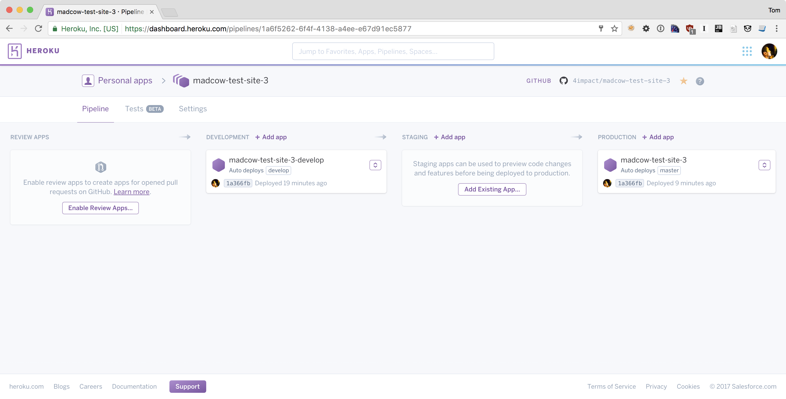
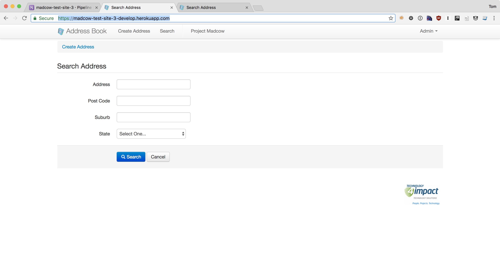
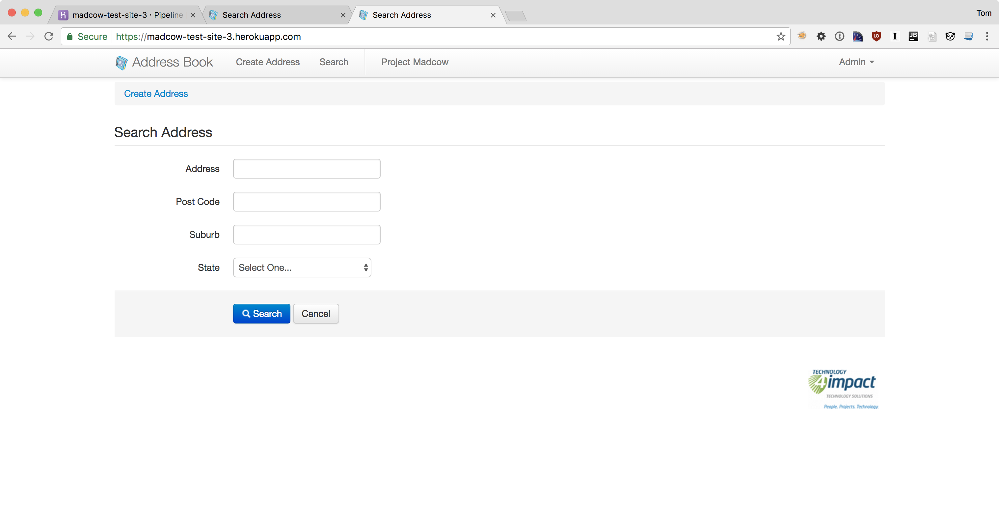

# Madcow Test Site 3[](https://travis-ci.org/4impact/madcow-test-site-3)

This is the third iteration of the **Madcow Test Site**. 

It is being ported based on the codebase from the grails 2.0 madcow-test-site application. 

The idea is that it will be built up and deployed to heroku for madcow to run against. 

It is intended to be hosted at 

- **master branch** - https://madcow-test-site-3.herokuapp.com

- **develop branch** - https://madcow-test-site-3-develop.herokuapp.com


and eventually when I add the CNAME at...

- https://madcow-test-site-3.4impact.net.au


### Notes
All the AJAX features of the old site are being revisited as they were deprecated in Grails v3.0. 

This has been built using the Grails for Heroku Grails 3 Example codebase and uses a Postgres backend DB.

It is visible here: https://github.com/kissaten/grails3-example

It uses Grails 3.0.1. 

### Building 
It will build on Travis CI before deploying. This build is here: 

https://travis-ci.org/4impact/madcow-test-site-3

### Deployment 
It will deploy automatically on push to the github branch in heroku. See pipeline here



Workflow should follow... 

 - Checkout develop branch
 - make changes
 - commit and push
 - test was successful at https://madcow-test-site-3-develop.herokuapp.com
 - checkout master branch
 - merge develop into master
 - push master 
 - test was successful at https://madcow-test-site-3.herokuapp.com


#### Screenshots
####Development Branch

####Production Branch



## Grails 3 on Heroku Example
To run this up locally install grails using 
```
curl -s "https://get.sdkman.io" | bash
sdk install grails 3.0.1
sdk use grails 3.0.1
```

and then just run 
```
grails run-app
```

To run this on heroku...
```
$ git clone <this repo>
$ heroku create
$ heroku addons:create heroku-postgresql
$ git push heroku master
```

or as I've already created it in heroku you just need to add the remote repo using
```
heroku git:remote -a madcow-test-site-3
git push heroku master
```
provided your heroku cli is installed correctly and you have permission to the app.

NOTE: You may find that this app fails to start up with in the 60 second
boot timeout limit imposed by Heroku. If that's the case, please contact
[Heroku Support](http://help.heroku.com).
